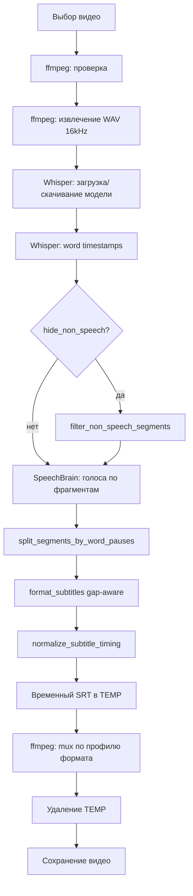

# SubForge — контекст для AI-агента

> **Обязательно:** при любом изменении поведения, архитектуры, UI, зависимостей или скриптов — обновляй этот файл в том же PR/коммите.  
> Пользовательская документация: [README.md](../README.md)

## Назначение

**SubForge** — десктоп-приложение для Windows. Пользователь выбирает видео → локально распознаётся речь (Whisper) → субтитры **вшиваются в выходной файл** (по умолчанию MP4) как soft-дорожка или burn-in (WebM). Отдельный `.srt` пользователю не отдаётся (временный файл только в `%TEMP%`).

Целевой сценарий: **японские фильмы**, дословная расшифровка **без цензуры/фильтрации текста**, всё **локально**.

## Стек

| Слой | Технология |
|------|------------|
| UI | CustomTkinter 6.x |
| ASR | faster-whisper (OpenAI Whisper) |
| Видео | ffmpeg + ffprobe |
| Язык | Python 3.10+ |
| ОС | Windows 10/11 |

## Структура проекта

```
addSub/
  main.py                 # точка входа → MainWindow
  launch.py               # запуск через ярлык (pythonw, без консоли)
  SubForge.spec           # PyInstaller onedir + CUDA
  build_exe.ps1           # сборка dist/SubForge/
  create_shortcut_release.ps1  # ярлык на release exe
  requirements.txt
  requirements-build.txt  # pyinstaller (только для сборки)
  README.md               # для пользователя
  docs/AGENT_CONTEXT.md   # этот файл — для агента
  setup.ps1               # venv + pip + ffmpeg + ярлык (один шаг)
  install_ffmpeg.ps1      # winget + копия в bin/
  create_shortcut.ps1     # SubForge.lnk (проект + рабочий стол)
  bin/                    # ffmpeg.exe, ffprobe.exe (не в git)
  tests/
    test_subtitle_timing.py  # unit-тесты таймингов субтитров
    test_settings.py         # unit-тесты settings.json
    test_cancellation.py     # unit-тесты отмены пайплайна
    test_hardware.py         # unit-тесты detect_acceleration
    test_eta.py                # unit-тесты EtaEstimator
    test_queue_lifecycle.py        # unit-тесты жизненного цикла очереди видео
    test_runtime_paths.py      # unit-тесты frozen/dev путей
    test_ffmpeg_mux_integration.py  # интеграционные тесты mux (в т.ч. video-only)
    test_ffmpeg_error.py         # unit-тесты _short_ffmpeg_error и compound mux errors
  app/
    __init__.py           # __app_name__, __version__
    runtime_paths.py      # app_dir, locale_dir, bin_dir (dev / PyInstaller)
    ui/
      main_window.py      # главное окно, потоки, колбэки UI
      log_viewer.py       # окно «Журнал» (просмотр ошибок в приложении)
      stage_progress.py   # панель прогресса (общий + 7 этапов)
      theme.py            # COLORS, FONTS, SPACE, CONTROL
    services/
      pipeline.py         # оркестрация обработки
      progress.py         # ProgressTracker, STAGES, веса этапов
      transcription.py    # WhisperTranscriber
      diarization.py      # различение голосов (SpeechBrain ECAPA)
      app_log.py          # запись ошибок в subforge.log + буфер в памяти
      engines.py          # пресеты «Простой» / «Сбалансированный» / «Мощный»
      hardware.py         # detect_acceleration() — CUDA / CPU для UI
      eta.py              # EtaEstimator, format_eta_duration — ETA в UI
      batch_queue.py      # BatchJob, build_jobs, resolve_output_path
      model_status.py     # проверка/скачивание моделей HF
      ffmpeg_service.py   # ffmpeg, прогресс из stderr, mux по профилю формата
      output_formats.py   # профили MP4/MKV/MOV/M4V/AVI/WebM/WMV
      subtitle_format.py  # объединение фрагментов, лимит строк на экране
      subtitle_phrases.py # разбиение cue по паузам между словами
      subtitle_timing.py  # нормализация end: не показывать субтитры в тишине
      non_speech_filter.py # фильтрация сегментов без слов ([laughter], ♪…)
      languages.py        # UI-метки, коды языков, transcribe/translate, ffmpeg metadata
      i18n.py             # локализация интерфейса (t(), set_locale)
      settings.py         # settings.json — ui_locale, движок, языки, переключатели
      cancellation.py     # CancellationToken, PipelineCancelledError
    locale/
      en.json             # English (default UI)
      ru.json, de.json, fr.json, it.json, ja.json
```

## Поток обработки



### Этапы прогресса (`app/services/progress.py`)

| id | id (i18n key) | Вес |
|----|---------------|-----|
| `ffmpeg` | `stage.ffmpeg` | 0.02 |
| `extract` | `stage.extract` | 0.10 |
| `model` | `stage.model` | 0.12 |
| `transcribe` | `stage.transcribe` | 0.48 |
| `diarize` | `stage.diarize` | 0.08 |
| `srt` | `stage.srt` | 0.02 |
| `mux` | `stage.mux` | 0.18 |

Общий прогресс = взвешенная сумма. UI: `StageProgressPanel` — в простое скрыты 7 этапов (`set_compact(True)`), при обработке раскрываются.

## Движки распознавания (`app/services/engines.py`)

| id | i18n key | Модель | По умолчанию |
|----|----------|--------|--------------|
| `powerful` | `engine.powerful.*` | `large-v3` | **да** |
| `balanced` | `engine.balanced.*` | `medium` | нет |
| `simple` | `engine.simple.*` | `base` | нет |

Порядок в UI (`ENGINE_ORDER`): powerful → balanced → simple.

Язык по умолчанию в UI: **English** (`en`) — и для речи, и для субтитров. Доступны: English, Deutsch, Français, Italiano, Japanese, Русский, Авто.

Два селектора в UI:
- **Язык речи** — подсказка Whisper при распознавании (`speech_language`)
- **Язык субтитров** — текст в SRT, перенос строк и метаданные дорожки (`subtitle_language`)

Логика Whisper (`app/services/languages.py`):
- Языки совпадают → `task="transcribe"`, `suppress_tokens=[]` (дословно)
- Речь не English, субтитры English → `task="translate"` (перевод на английский)
- Иначе (разные языки, субтитры не English) → ошибка до старта пайплайна

## Ключевые модули

### `pipeline.py`
- `SubtitlePipeline.process()` — главный метод
- Параметры `speech_language` и `subtitle_language` (по умолчанию **en**)
- Параметр `max_subtitle_lines` (по умолчанию **2**) — передаётся в форматирование SRT
- Параметр `separate_speakers` (по умолчанию **true**) — различение голосов перед форматированием
- Параметр `hide_non_speech` (по умолчанию **false**) — удаление сегментов Whisper без слов (`[laughter]`, `[sigh]`, `♪` и т.п.); после transcribe, до diarization
- Параметр `output_format` (по умолчанию **mp4**) — профиль контейнера для mux
- Параметр `cancel: Optional[CancellationToken]` в `process()` — cooperative cancellation
- Колбэк: `Callable[[ProgressSnapshot], None]`
- Возвращает `PipelineResult(output_path, segment_count)`

### `diarization.py`
- `assign_speakers()` — ECAPA-TDNN (SpeechBrain), кластеризация по голосу
- WAV для diarization читается через stdlib `wave` (ffmpeg уже отдаёт 16 kHz mono pcm_s16le)
- Внутренние id говорящих **не попадают в текст** субтитров
- Модель кэшируется в `%LOCALAPPDATA%/SubForge/models/spkrec-ecapa-voxceleb`
- Загрузка с `LocalStrategy.COPY` (копирование файлов, без symlink — важно для Windows без Developer Mode)
- При первом запуске нужен интернет для скачивания модели голосов (~90 МБ)

### `app_log.py`
- `setup_app_logging()` — инициализация при старте (`main.py`, `launch.py`)
- `log_exception(context, exc)` — ERROR + traceback в файл и в память
- `read_log_text(max_lines)` — текст для UI журнала (память → файл)
- `format_log_hint()` — подсказка открыть «Журнал» в приложении

### `log_viewer.py`
- `LogViewerWindow` — модальное окно: текст журнала, обновить, копировать, папка лога
- Открывается кнопкой «Журнал» в footer `main_window.py` или после ошибки

### `non_speech_filter.py`
- `is_non_speech_text()` — сегмент только из звуковых меток (скобки, ♪, полноширинные скобки)
- `filter_non_speech_segments()` — убирает такие сегменты из списка; смешанные («Да [laughter]») не трогает

### `subtitle_phrases.py`
- `split_segments_by_word_pauses()` — делит Whisper-сегменты на короткие cue по паузам между словами
- `PHRASE_PAUSE_SEC = 0.45` — порог паузы между словами для нового cue
- Вызывается в `pipeline.py` после diarization, **до** `format_subtitles`
- Каждый cue: `start`/`speech_end` по первому/последнему слову группы; `speaker` наследуется

### `subtitle_format.py`
- `format_subtitles()` — объединяет фрагменты Whisper, переносит текст и ограничивает строк на экране (1–4)
- `MAX_MERGE_GAP_SEC = 1.2` — не сливать соседние фрагменты через паузу длиннее этого порога
- При merge/collapse/cluster `end` вычисляется из `speech_end + END_PADDING_SEC`, не из завышенного Whisper `seg.end`
- Если задан `speaker`: реплики с **пересечением по времени** объединяются в один SRT-блок; разные говорящие — **отдельные строки** (`\n`), без подписей «Спикер 1»; не более `max_lines` строк (одна на говорящего; при 3+ — с наибольшим временем речи)
- Один говорящий без перекрытия с другими — перенос длинной реплики до `max_lines` как раньше
- `DEFAULT_MAX_LINES = 2`; для CJK ~18 символов в строке, для латиницы ~42

### `subtitle_timing.py`
- `normalize_subtitle_timing()` — финальная обрезка `end`: не дольше `speech_end + END_PADDING_SEC` и до `next.start - MIN_CUE_GAP_SEC` (0.05 с)
- Fallback для сегментов **без** `words`: если `speech_end` совпадает с сырым Whisper `end` и пауза > `MAX_SPEECH_SPAN_SEC` (18 с) при коротком тексте — оценка длительности по символам
- Применяется ко **всем** cue, включая последний в файле
- Вызывается в `pipeline.py` после `format_subtitles`, перед `write_srt`
- Минимальная длительность cue: 0.05 с

### `transcription.py`
- `WordTiming` — текст и границы одного слова Whisper
- `Segment.words` — список слов с таймингами (для phrase split)
- `Segment.speech_end` — фактический конец речи (конец последнего слова); `end` = `display_end(speech_end)`
- `WhisperTranscriber` — ленивая загрузка модели
- `word_timestamps=True`, `hallucination_silence_threshold=2.0`, `vad_parameters.min_silence_duration_ms=500` — точнее границы речи
- `END_PADDING_SEC = 0.08` — короткий padding после последнего слова (~3 кадра при 24 fps)
- `display_end(speech_end)` — единый расчёт видимого конца cue
- Границы сегмента: по первому/последнему слову, если words доступны; иначе segment-level timestamps
- Параметр `task`: `"transcribe"` или `"translate"` (перевод только на английский)
- CUDA если доступна (`float16`), иначе CPU (`int8`)
- Скачивание модели через `faster_whisper.utils.download_model` если нет в кэше

### `languages.py`
- `UI_LANGUAGE_LABELS`, `ui_label_to_code()`, `normalize_for_ffmpeg()` — **языки речи/субтитров Whisper**, не язык интерфейса
- `whisper_task(speech, subtitle)` — выбор transcribe/translate
- `validate_language_pair()` — проверка пары языков до пайплайна (сообщение через `t()`)

### `i18n.py`
- `DEFAULT_LOCALE = "en"` — язык интерфейса по умолчанию
- `SUPPORTED_LOCALES`: en, ru, de, fr, it, ja
- `set_locale(code)`, `t(key, **kwargs)`, `current_locale()`
- Каталоги: `app/locale/{code}.json`, fallback на `en`

### `settings.py`
- `%LOCALAPPDATA%\SubForge\settings.json` (fallback `~/.subforge/settings.json`)
- Поля: `ui_locale`, `engine_id`, `speech_language`, `subtitle_language`, `max_subtitle_lines`, `separate_speakers`, `hide_non_speech`, `output_format`
- Хранятся **коды/id**, не локализованные подписи UI; невалидные значения нормализуются при загрузке
- Сохранение при изменении любого параметра в UI (`_persist_settings()` в `main_window.py`)
- `load_settings()` / `save_settings()`

### `cancellation.py`
- `CancellationToken` — флаг отмены; `request_cancel()`, `check()` (raises `PipelineCancelledError`)
- Проверки между этапами пайплайна, в циклах Whisper/diarization и в `_run_with_progress` (kill ffmpeg)
- При отмене во время mux — частичный выходной файл удаляется в `pipeline.process()`

### `ffmpeg_service.py`
- Поиск: `bin/ffmpeg.exe` → PATH → WinGet Packages
- `has_audio_stream()` — ffprobe: есть ли аудиодорожка (до извлечения)
- `describe_media_streams()` — сводка потоков для журнала
- `NoAudioStreamError` — видео без встроенного звука (часто после Topaz *_prob4*)
- Параметр `audio_source` в `pipeline.process()` — звук из другого файла, субтитры в `input_video`
- `_short_ffmpeg_error()` — короткое сообщение вместо полного stderr ffmpeg (приоритет строкам Error/Invalid; без progress-хвоста `frame=0`)
- `_format_mux_errors()` — compound-сообщение при падении одной или нескольких попыток mux; hint для больших MP4 при `-22`
- `_estimate_mux_output_bytes()` / `_check_output_disk_space()` — preflight места на томе выхода (~2× размер видео под faststart)
- `_safe_unlink_output()` — удаление битого выхода между попытками
- `_include_audio_in_mux()` / `_build_soft_mux_cmd(use_faststart=…)` — audio `-map`/`-c:a` только если ffprobe видит аудиодорожку
- `_run_with_progress(log_context=…)` — парсит `time=HH:MM:SS.ms` из stderr; при ошибке полный stderr (до 12 KB) в `subforge.log`; при `cancel.is_cancelled` — `proc.kill()`
- `copy_mux_timeout()` — для больших/длинных файлов таймаут copy-mux как у re-encode (до 4 ч)
- `mux_subtitles()` — mux по `OutputFormatProfile` из `output_formats.py`
- `mux_soft_subtitles()` — обёртка для MP4 (совместимость)
- Soft MP4/MOV/M4V: **copy + faststart** → **copy без faststart** → **re-encode + faststart**; MKV → `srt`; все ошибки в UI/журнале
- WebM: burn-in через `-vf subtitles=...`, VP9 + Opus (отдельной дорожки нет)
- `get_media_duration()` — ffprobe рядом с ffmpeg
- Таймауты: проверка 12с; короткие команды 600с; copy/re-encode больших роликов — до 4 ч (`encode_timeout`)

### `model_status.py`
- `get_model_status()` — `download_model(..., local_files_only=True)`
- `download_engine_model()` — явное скачивание (кнопка «Скачать»)
- `MODEL_DOWNLOAD_SIZE`: base ~150 МБ, medium ~1.5 ГБ, large-v3 ~3 ГБ

### `hardware.py`
- `AccelerationInfo` — `cuda_available`, `gpu_name`
- `detect_acceleration()` — ctranslate2 (Whisper) + `torch.cuda.get_device_name` при наличии CUDA
- Вызывается асинхронно при старте UI; строка статуса GPU/CPU в `main_window.py`

### `eta.py`
- `EtaEstimator` — линейная ETA по `overall` (порог: overall ≥ 3%, elapsed ≥ 10 с)
- `format_eta_duration(seconds)` — локализованная строка для UI

### `output_formats.py`
- `OutputFormatProfile` — расширение, режим (`soft` / `burn_in`), codec субтитров, fallback-кодеки
- `OUTPUT_FORMAT_ORDER`: mp4, mkv, mov, m4v, avi, webm, wmv; default **mp4**
- `get_profile()`, `resolve_extension()`, UI-метки через `t("output_format.*")`

### `batch_queue.py`
- `BatchJob` — `input_video`, `output_video`, опционально `audio_source`
- `resolve_output_path(..., output_format?)` — `{stem}_subtitles.{ext}`, суффикс `_2` при коллизии
- `build_jobs(inputs, output_dir)` — список job для последовательной обработки

### `runtime_paths.py`
- `is_frozen()` — PyInstaller (`sys.frozen`)
- `app_dir()` — корень: репозиторий (dev) или папка с `SubForge.exe` (release)
- `internal_dir()` — `sys._MEIPASS` / корень dev
- `locale_dir()` — `app/locale` (JSON для i18n)
- `bin_dir()` — `bin/` **рядом с exe** (ffmpeg не в `_internal`)

### `main_window.py`
- Обработка в `threading.Thread` (daemon)
- UI-обновления через `self.after(0, ...)`
- При старте: `load_settings()` → `set_locale()` → `_build_ui()` → `_present_window()` (`withdraw` → `after_idle` → `geometry 840×620` по центру экрана → `deiconify` → `_setup_drag_drop`)
- Footer: селектор **языка интерфейса** (English / Русский / …) + кнопка «Log»
- `_apply_locale()` — обновление текстов без перезапуска; `_on_ui_locale_change()` и `_persist_settings()` сохраняют `settings.json`
- Кнопка **«Отмена»** — `CancellationToken` в worker-потоке; `_on_cancelled()` без диалога ошибки
- Фоновый canvas: `_on_bg_canvas_configure` / `_ensure_atmosphere_items` / `_update_accent_pulse` — без `delete("all")` на каждый кадр
- `_ffmpeg_ok` — блокирует старт без ffmpeg
- **Drag-and-drop** видео: `windnd.hook_dropfiles` только на **корневое окно** (`self`, `force_unicode=True`); хук ставится **после** показа окна в `_present_window`, не в `__init__`. Из WndProc — только `put_nowait` в `_drop_queue`; UI обновляется через `_poll_drop_queue()` каждые 100 ms. Ошибки setup → `log_exception("drag_drop_setup")`; валидные файлы **добавляются в очередь**
- **Очередь видео**: `_queue: list[Path]`, список в UI, multi-select в диалоге выбора; после **успешной** обработки файла он удаляется из `_queue` (`_remove_from_queue_by_path` в `_on_success`); по завершении всего пакета `_queue` очищается в `_on_batch_complete`
- **Пакетная обработка**: «Создать субтитры» → `askdirectory` → preflight (файлы существуют, есть аудио) → `build_jobs` → последовательный `_launch_pipeline`; при ошибке или отмене — **вся очередь останавливается**, необработанные файлы **остаются в `_queue`** для повторного запуска
- **ETA**: `EtaEstimator` в `_apply_progress`, метка в `StageProgressPanel` (`progress.eta_remaining`, позиция `File N / M`)
- **Индикатор GPU/CPU**: `_accel_status`, `_check_acceleration_async`, `_apply_accel_status` (обновляется при смене языка UI)
- Ярлык dev: `launch.py` + `.venv/Scripts/pythonw.exe`; release: `dist/SubForge/SubForge.exe`

## Сборка standalone exe (PyInstaller)

```
dist/SubForge/
  SubForge.exe       # entry: launch.py, console=False
  _internal/         # Python + torch CUDA + faster-whisper + UI
  bin/
    ffmpeg.exe
    ffprobe.exe
```

- Spec: [`SubForge.spec`](../SubForge.spec) — onedir, `collect_submodules("app")` (импорты в `launch.py` внутри `main()`), `collect_all` для torch/ctranslate2/speechbrain
- Скрипт: `powershell -ExecutionPolicy Bypass -File .\build_exe.ps1` (CUDA torch cu124, затем PyInstaller, копия ffmpeg в `dist/SubForge/bin/`)
- Ярлык release: `create_shortcut_release.ps1`; `create_shortcut.ps1` предпочитает exe из dist, иначе dev
- Модели Whisper/SpeechBrain **не** в exe — кэш `%LOCALAPPDATA%` как в dev
- Размер дистрибутива ~2–4 ГБ

## UI (`app/ui/`)

- Окно: при старте **скрыто до готовности layout** (`withdraw`), затем показывается **840×620 по центру экрана** (`after_idle` → `_present_window` → `deiconify`); `minsize` 800×580; `CTkScrollableFrame` для малых экранов
- Тема: тёмно-синий/графит, акцент `#3DDC97` (`theme.py`)
- Декоративный фон: `tk.Canvas` под контентом (`place` на весь shell); `<Configure>` только на canvas (не на root) — перерисовка при **resize**, не при drag; элементы canvas переиспользуются, пульсация верхней линии через `itemconfig`
- Статусы: модель (badge + overview), **GPU/CPU** (`hardware.py`), ffmpeg (отдельная строка)
- Зона выбора файла: кнопка «Выбрать видео» (multi), **перетаскивание** одного или нескольких файлов, список очереди с удалением
- Прогресс: общий `%`, этапы, **ETA** текущего файла, позиция в очереди «Файл N / M»
- Кнопка «Скачать» — в строке с выбором движка
- Настройка **«Формат выхода»** — MP4 (default), MKV, MOV, M4V, AVI, WebM, WMV; подсказки для WebM и AVI/WMV
- Настройка **«Строк субтитров на экране»** (1–4, по умолчанию 2) — под движком и языками
- Селекторы **«Язык речи»** и **«Язык субтитров»** — в правой колонке настроек
- Переключатель **«Различать говорящих»** — разные голоса на разных строках, без подписей
- Переключатель **«Скрывать эмоциональные звуки (без слов)»** — убирает сегменты вроде `[laughter]`, `[sigh]`, `♪`; по умолчанию выключен (дословно)
- **Язык интерфейса** — селектор в footer (по умолчанию **English**); не путать с «Язык речи» / «Язык субтитров»
- Настройки обработки **запоминаются** между запусками (движок, языки, переключатели)
- Кнопка **«Отмена»** рядом с «Создать субтитры» — активна во время обработки

## Запуск

```powershell
cd c:\samson\addSub
.\.venv\Scripts\Activate.ps1
python main.py
```

Быстрая установка: `setup.ps1` (venv + pip + ffmpeg + ярлык); `-Recreate` — пересоздать `.venv`  
Ярлык: `create_shortcut.ps1` → `SubForge.lnk`  
Release exe: `build_exe.ps1` → `dist\SubForge\SubForge.exe`  
ffmpeg: `install_ffmpeg.ps1`

## Ограничения продукта

- Soft subs (`mov_text` / `srt`) — дорожка помечена `default+forced` для автопоказа в VLC/PotPlayer; «Кино и ТВ» Windows — слабо
- **WebM** — только burn-in (субтитры в кадре), soft-дорожка в контейнере невозможна
- Выход по умолчанию **MP4**; формат выбирается в UI и сохраняется в settings
- Первый запуск «Мощного» — ~3 ГБ модель; «Сбалансированного» — ~1.5 ГБ (интернет один раз)
- Whisper переводит **только на английский** (`task="translate"`); другие пары языков не поддерживаются

## Матрица: что обновлять при изменениях

| Меняешь | Обнови |
|---------|--------|
| Новый этап пайплайна / веса прогресса | `progress.py`, `pipeline.py`, `stage_progress.py`, этот файл |
| Новый движок / модель | `engines.py`, `model_status.py` (MODEL_DOWNLOAD_SIZE), README, этот файл |
| UI layout / тексты | `main_window.py`, `app/locale/*.json`, `i18n.py`, `theme.py`, при необходимости этот файл |
| Язык интерфейса / новая локаль | `i18n.py`, `settings.py`, `app/locale/`, `main_window.py`, README, этот файл |
| Настройки пользователя (settings.json) | `settings.py`, `main_window.py`, `languages.py`, README, этот файл |
| Отмена обработки | `cancellation.py`, `pipeline.py`, `ffmpeg_service.py`, `transcription.py`, `diarization.py`, `main_window.py`, `batch_queue.py`, `app/locale/`, README, этот файл |
| Формат субтитров / строк на экране | `subtitle_format.py`, `subtitle_phrases.py`, `subtitle_timing.py`, `pipeline.py`, `main_window.py`, этот файл |
| Тайминги субтитров (gap merge, phrase split, normalize) | `subtitle_phrases.py`, `subtitle_format.py`, `subtitle_timing.py`, `transcription.py`, `pipeline.py`, `tests/test_subtitle_timing.py`, этот файл |
| Фильтрация эмоциональных звуков | `non_speech_filter.py`, `pipeline.py`, `main_window.py`, `app/locale/`, README, этот файл |
| Различение говорящих | `diarization.py`, `subtitle_format.py`, `pipeline.py`, `requirements.txt`, README, этот файл |
| Логирование ошибок | `app_log.py`, `log_viewer.py`, `main_window.py`, `main.py`, `launch.py`, README, этот файл |
| ffmpeg поведение / форматы выхода | `ffmpeg_service.py`, `output_formats.py`, `pipeline.py`, `batch_queue.py`, `install_ffmpeg.ps1`, README, этот файл |
| Зависимости | `requirements.txt` (+ `windnd` для DnD на Windows), README |
| Ярлык / запуск / setup | `setup.ps1`, `launch.py`, `create_shortcut.ps1`, `create_shortcut_release.ps1`, README |
| Standalone exe / PyInstaller | `SubForge.spec`, `build_exe.ps1`, `runtime_paths.py`, `ffmpeg_service.py`, `i18n.py`, README, этот файл |
| Поведение Whisper / языки | `languages.py`, `transcription.py`, `pipeline.py`, `main_window.py`, README, этот файл |

## Команды (Windows PowerShell)

- Не использовать `&&` — только `;` или отдельные команды
- Пути: `c:\samson\addSub\...`
- UTF-8 для всех файлов

## Версия

См. `app/__init__.py` → `__version__` (сейчас отображается в footer UI).
